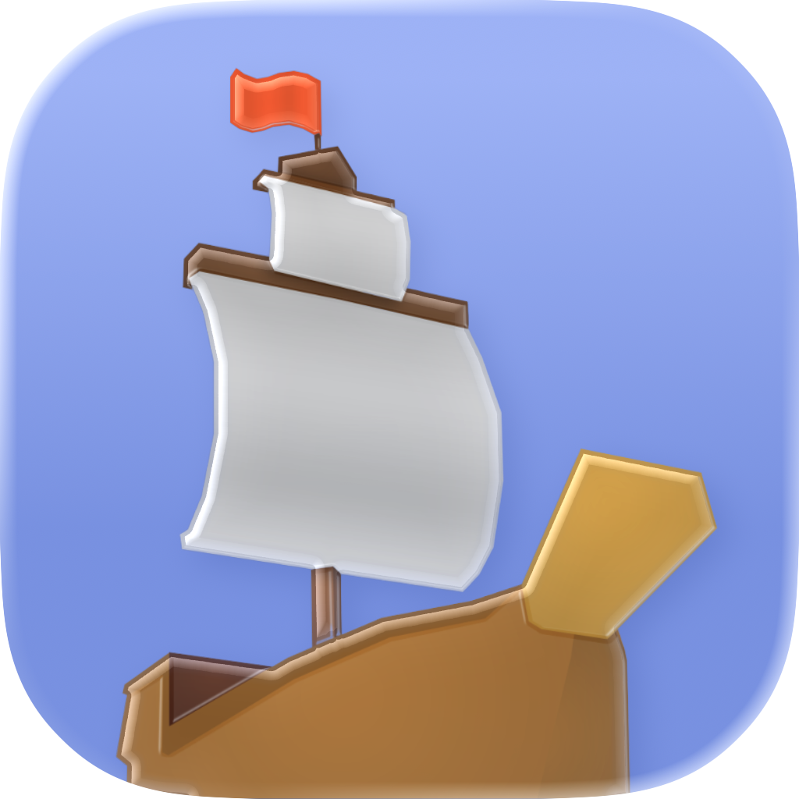
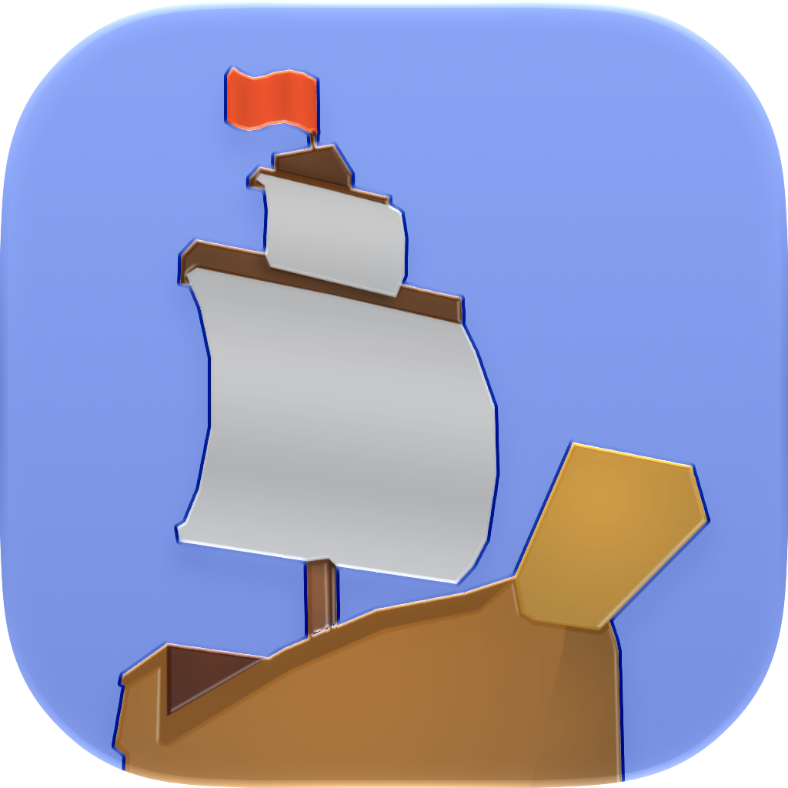

<p align="center">
  
  &nbsp;&nbsp;&nbsp;
  
  <br>
  <sub><b>Liquid Glass app icon</b> &nbsp;—&nbsp; macOS 26 Tahoe (left) &nbsp;·&nbsp; macOS 27 Golden Gate (right)</sub>
</p>

# Ship of Harkinian — macOS

A macOS-optimized fork of [HarbourMasters/Shipwright](https://github.com/HarbourMasters/Shipwright)
(the *Ocarina of Time* PC port, "Ship of Harkinian", built on
[libultraship](https://github.com/Kenix3/libultraship)).

The goal of this fork is simple: **a plain build produces a self-contained, codesigned
`Ship of Harkinian.app`** that launches on any modern Apple-Silicon Mac with no extra setup — plus
crisp Retina text, a native Liquid Glass icon, and the handful of fixes needed to build cleanly on a
current Apple-clang / CMake toolchain. Gameplay, assets, and the rest of the project are unchanged
from upstream `9.2.3` — you still provide your own *Ocarina of Time* ROM.

---

## Download & run

1. Grab `ShipOfHarkinian-v9.2.3-macOS-arm64.zip` from
   [Releases](https://github.com/quarrel07/Shipwright-macOS/releases) and unzip it.
2. The app is **ad-hoc codesigned**, so on first launch right-click `Ship of Harkinian.app` → **Open**
   (or run `xattr -dr com.apple.quarantine "Ship of Harkinian.app"`) to get past Gatekeeper.
3. On first run the game asks for a supported **Ocarina of Time ROM** (`.z64`). Verify your dump
   against the [supported hashes](docs/supportedHashes.json). It extracts `oot.o2r` into
   `~/Library/Application Support/com.shipofharkinian.soh/` — this can take a minute — then boots
   straight to the title screen.

No copyrighted assets are bundled. You must supply your own legally-dumped ROM.

## What this fork changes

| # | Area | Fix |
|---|------|-----|
| 1 | **libultraship** `cmake/dependencies/mac.cmake` | A stale `/Library/Frameworks/SDL2.framework` can win `find_package(SDL2)` over Homebrew's and break configure. Search frameworks last and add the Homebrew prefix to `CMAKE_PREFIX_PATH`. |
| 2 | **Crisp Retina menu text** (`libultraship`, `OTRGlobals.cpp`) | The ImGui overlay was rasterized at logical point size and stretched to the Retina framebuffer → fuzzy menus. Detect the display backing scale (`Gui::GetDpiScale`) and rasterize every font (`ImFontConfig::RasterizerDensity`) at that scale. The menu fonts are baked at `backingScale × maxMenuScale` so text also stays sharp at every **Settings → ImGui scale** option, not just the default. |
| 3 | **Packaging** `CMake/macos/apple_bundle.cmake` | Build a self-contained `.app`: set `MACOSX_BUNDLE`, compile the Liquid Glass icon, bundle `soh.o2r` + the first-run extractor assets into `Contents/Resources`, relink Homebrew dylibs into `Contents/Frameworks`, copy the configured `Info.plist`, and ad-hoc codesign. Homebrew's `sdl2` is now **sdl2-compat**, which `dlopen`s SDL3 at runtime — `fixup_bundle` can't see a `dlopen`, so `libSDL3.dylib` is copied in by hand (otherwise the app aborts with *"Failed loading SDL3 library."*). |
| 4 | **Clean quit** `OTRGlobals.cpp` | When you decline the first-run extractor prompt the app bailed via `exit()`, which ran a static `Context`/`spdlog` destructor during teardown and **segfaulted on a clean quit**. The pre-init bail-outs now use `_Exit()`, so declining quits silently. |
| 5 | **Liquid Glass app icon** `soh/macosx/sohicon.icon` | A native [Icon Composer](https://developer.apple.com/documentation/Xcode/creating-your-app-icon-using-icon-composer) icon compiled with `actool` into `Assets.car` (+ an `.icns` fallback), so the Dock/Finder icon uses the real macOS 26+ Liquid Glass material instead of a flat PNG. |
| 6 | **Metadata** `Info.plist.in` | `CFBundleIconName`/`CFBundleIconFile = sohicon`; mark the app HiDPI-capable; point the writable data folder at `~/Library/Application Support/com.shipofharkinian.soh` via `SHIP_HOME` (`LSEnvironment` in the bundle + a `setenv` fallback in `InitOTR` for the raw binary). |

## File layout at runtime

* **`Ship of Harkinian.app/Contents/Resources`** (read-only) — `soh.o2r` (port assets),
  `gamecontrollerdb.txt`, and `assets/` (the XML + extractor definitions the first-run ROM extractor
  needs), plus the compiled icon (`Assets.car`, `sohicon.icns`).
* **`~/Library/Application Support/com.shipofharkinian.soh/`** (writable) — `oot.o2r` extracted from
  your ROM on first run, plus config, save data, logs, and the `mods/` folder.

## Building it yourself

```bash
brew install cmake ninja sdl2 sdl3 sdl2_net libpng glew libzip nlohmann-json tinyxml2 spdlog libogg libvorbis boost
git clone --recurse-submodules https://github.com/quarrel07/Shipwright-macOS.git
cd Shipwright-macOS
cmake --no-warn-unused-cli -H. -Bbuild-cmake -GNinja -DCMAKE_BUILD_TYPE=Release
cmake --build build-cmake          # produces build-cmake/soh/Ship of Harkinian.app
```

A fresh recursive clone builds turnkey — the submodule fix lives on a fork that `.gitmodules` already
points at, so no manual patching is needed. `sdl3` is required at build time because the bundled
sdl2-compat shim loads it. The Liquid Glass icon step needs **full Xcode 26+** installed (for
`actool`); the rest builds with the Command Line Tools. Pass `-DSOH_BUNDLE_DEPS=OFF` to skip the
dylib/SDL3 bundling for a local-only build that uses your Homebrew libraries directly.

## Submodule fork used

| Submodule | Fork / branch | Change |
|-----------|---------------|--------|
| `libultraship` | [`quarrel07/libultraship@shipwright-macos`](https://github.com/quarrel07/libultraship/tree/shipwright-macos) | SDL2 framework build fix (#1) + HiDPI font density (#2) |

The fork branches from the exact commit upstream Shipwright pins, so this fork tracks upstream
`9.2.3` with only the macOS-specific deltas above. `ZAPDTR` and `OTRExporter` are unchanged and still
point at upstream.

## Credits

All credit for Ship of Harkinian goes to the **[HarbourMasters](https://github.com/HarbourMasters)**
team and contributors, and to **[Kenix3](https://github.com/Kenix3)** / the libultraship project.
This fork only adds macOS build, packaging, and quality-of-life fixes.
